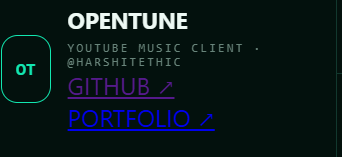
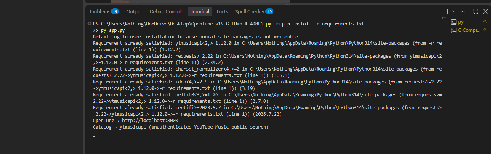
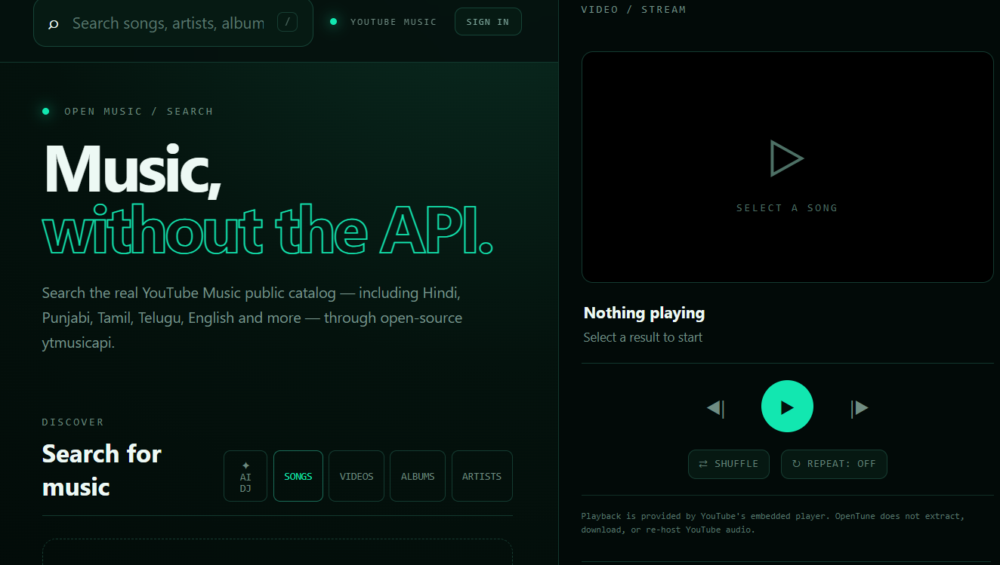
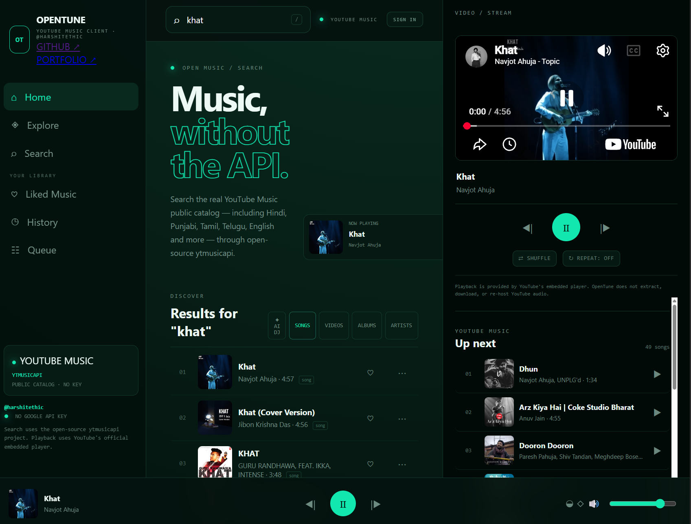
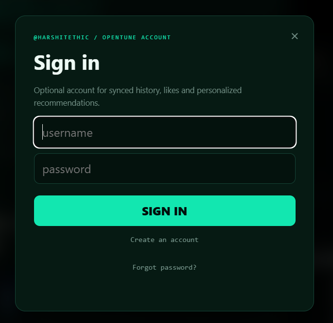
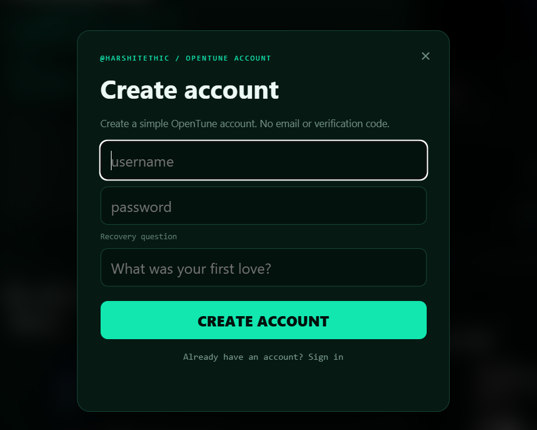
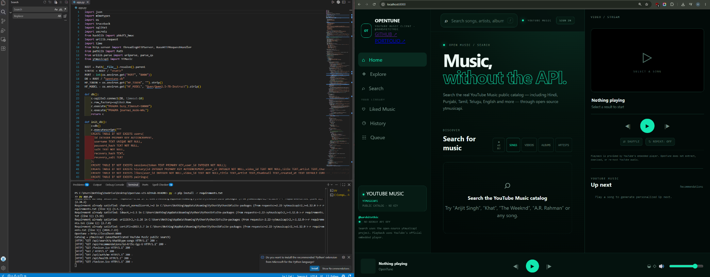

# 🎧 OpenTune

### A YouTube Music-style open-source music player — without the clutter.

**OpenTune** is an open-source web music client built by **[@harshitethic](https://github.com/harshitethic)**.

It is designed to feel familiar to YouTube Music while using a custom **OpenTune / @harshitethic** interface: dark, minimal, fast, and focused on listening.

> **Search music. Play it. Build a queue. Keep your history. Discover more.**

---

## ✨ Features

### 🎵 Music discovery
- Search the public YouTube Music catalog
- Search by songs, artists, albums and videos
- Supports international music, including Hindi, Punjabi, Tamil, Telugu, English, and more
- Uses the open-source [`ytmusicapi`](https://github.com/sigma67/ytmusicapi) project
- No Google Cloud API key required

### ▶️ Playback
- YouTube's official embedded player
- Play songs directly from search results
- Previous / next controls
- Persistent bottom player
- Volume control
- Shuffle
- Repeat
- Up Next queue

### 🧠 Discovery & recommendations
- Recommendation section
- Queue-based listening
- Recently played history
- Personalized recommendations when an OpenTune account is enabled

### ❤️ Personal library
- Like songs
- Listening history
- Queue
- Optional account system

### 👤 Simple OpenTune accounts

Accounts are completely optional.

Sign up with:

```text
Username
Password
Recovery question
Recovery answer
```

Password recovery uses the recovery answer.

There is intentionally:

- ❌ No Google OAuth
- ❌ No email verification
- ❌ No phone verification
- ❌ No QR authentication
- ❌ No API key required

This is a simple local account system intended for the OpenTune project.

---

## 🎨 Design

OpenTune is styled around the **@harshitethic** portfolio aesthetic:

- Deep green / black interface
- Neon mint accents
- Minimal typography
- Technical / developer-inspired UI
- YouTube Music-inspired information architecture

---

## 🖥️ Screenshots

### Home


### Search & playback


### Queue & Up Next


### Sign in


### Create account


### Mobile / responsive UI


### Project in development


---

## 🏗️ Architecture

```text
┌──────────────────────────────┐
│          OpenTune UI         │
│      HTML / CSS / JS         │
└──────────────┬───────────────┘
               │
               ▼
┌──────────────────────────────┐
│        OpenTune Server       │
│          Python              │
└──────────────┬───────────────┘
               │
        ┌──────┴──────┐
        ▼             ▼
┌──────────────┐ ┌──────────────┐
│  ytmusicapi  │ │   SQLite     │
│ Music search │ │ Accounts /   │
│              │ │ History /    │
│              │ │ Likes        │
└──────┬───────┘ └──────────────┘
       │
       ▼
┌──────────────────────────────┐
│ YouTube official embedded    │
│ player                       │
└──────────────────────────────┘
```

OpenTune does **not** download, extract, or re-host YouTube audio.

---

## 🚀 Getting Started

### Requirements

- Python 3.10+
- A modern browser
- Internet connection

### 1. Clone

```bash
git clone https://github.com/harshitethic/OpenTune.git
cd OpenTune
```

### 2. Install dependencies

Windows:

```powershell
py -m pip install -r requirements.txt
```

macOS / Linux:

```bash
python3 -m pip install -r requirements.txt
```

### 3. Start OpenTune

Windows:

```powershell
py app.py
```

macOS / Linux:

```bash
python3 app.py
```

### 4. Open the app

```text
http://localhost:8000
```

---

## 📁 Project Structure

```text
OpenTune/
├── static/
│   └── index.html
├── docs/
│   ├── opentune-1.png
│   ├── opentune-2.png
│   ├── opentune-3.png
│   ├── opentune-4.png
│   ├── opentune-5.png
│   ├── opentune-6.png
│   └── opentune-7.png
├── app.py
├── requirements.txt
├── README.md
└── LICENSE
```

`opentune.db` is generated locally at runtime and should not be committed.

---

## 🔧 Configuration

OpenTune is designed to run without paid APIs.

There is no Google/YouTube API key required for the core music search.

The project uses the public functionality exposed through the open-source `ytmusicapi` ecosystem.

---

## 🔐 Privacy & accounts

OpenTune does not require an account to search and listen.

If you create an OpenTune account, account-related data is used for features such as history, likes, recommendations, and password recovery.

Do not use a password you use for important external accounts.

The built-in recovery-question system is intentionally simple and **should not be treated as enterprise-grade authentication**.

---

## ⚠️ Important

OpenTune is an independent open-source project.

It is **not affiliated with, endorsed by, or sponsored by YouTube or Google**.

YouTube playback is provided through YouTube's official embedded player.

OpenTune does not:

- Download YouTube audio
- Re-host YouTube audio
- Circumvent YouTube playback restrictions
- Provide DRM bypass functionality

Users are responsible for complying with the terms and laws applicable to the services and content they access.

---

## 🛠️ Roadmap

- [ ] Better recommendation engine
- [ ] Improved mobile experience
- [ ] PWA / installable app
- [ ] Playlists
- [ ] Public playlists
- [ ] Artist pages
- [ ] Album pages
- [ ] Better queue management
- [ ] Keyboard shortcuts
- [ ] More personalization
- [ ] Optional local AI music recommendations
- [ ] Accessibility improvements

---

## 🤝 Contributing

Contributions are welcome.

```bash
git fork https://github.com/harshitethic/OpenTune
```

Then:

```bash
git checkout -b feature/my-feature
```

Make your changes, test them locally, and open a pull request.

Good first contributions include UI improvements, bug fixes, mobile responsiveness, accessibility, search improvements, recommendation logic, documentation, and tests.

---

## 🧪 Development

Run the server locally:

```bash
py app.py
```

Then open:

```text
http://localhost:8000
```

Before submitting a PR, make sure the app starts, search works, playback works, account functionality remains intact, and no secrets or runtime database files are committed.

---

## 📜 License

Released under the [MIT License](LICENSE).

---

## 👨‍💻 Built by

### @harshitethic

**GitHub:** https://github.com/harshitethic  
**Portfolio:** https://harshitethic.com

---

## ⭐ Support the project

If OpenTune is useful to you:

⭐ Star the repository  
🐛 Report bugs  
💡 Suggest features  
🔧 Submit pull requests  
📢 Share the project

---

<p align="center">
  <strong>OpenTune</strong><br>
  Open music. Your way.
</p>
